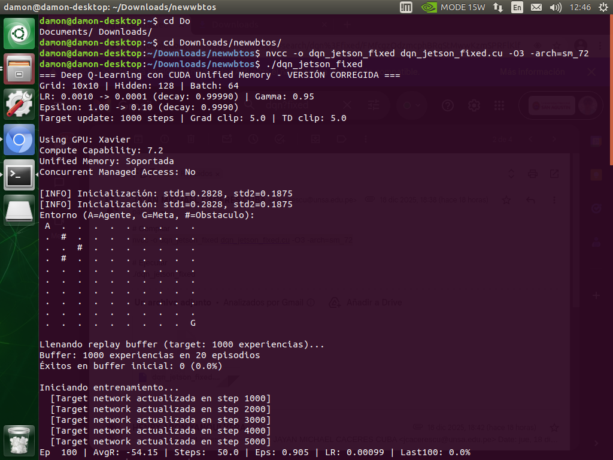
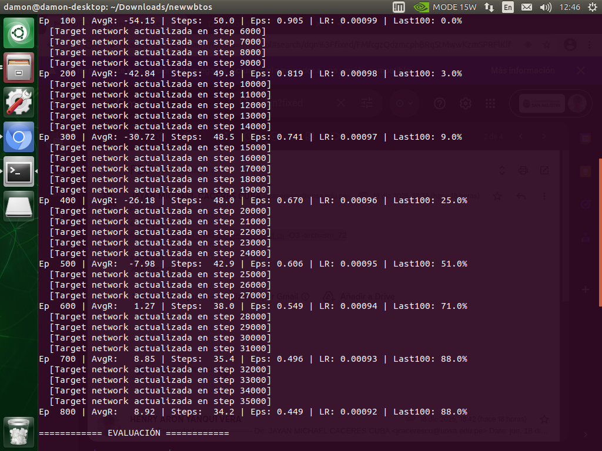
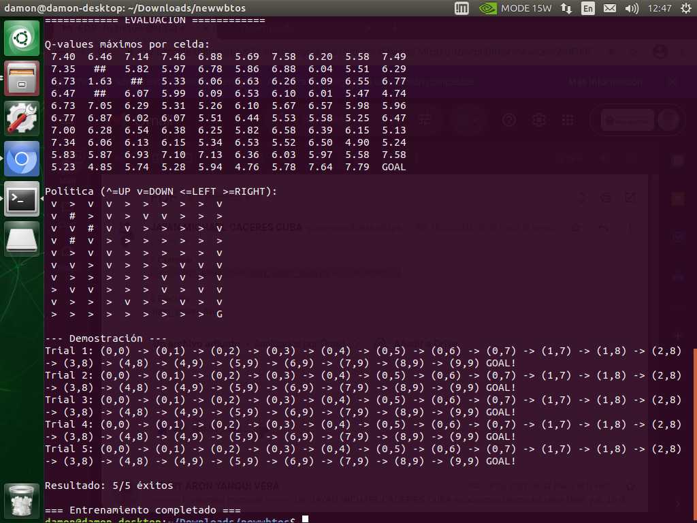

# Proyecto Final de Robótica - Deep Q-Learning con CUDA

Este proyecto implementa **Deep Q-Network (DQN)** acelerado con CUDA para resolver problemas de navegación y control robótico. El proyecto está dividido en tres componentes principales que demuestran la escalabilidad del algoritmo desde entornos simulados simples hasta implementaciones en hardware real.

## Integrantes del Proyecto

| Integrante | Participación |
|-----------|---------------|
| DIAZ CASTRO, BERLY JOEL | 14.28% |
| MARIÑOS HILARIO, PRINCCE YORWIN | 14.28% |
| YANQUI VERA, HENRY ARON | 14.28% |
| CACERES CUBA, JAYAN MICHAEL | 14.28% |
| APAZA CONDORI, JHON ANTHONY | 14.28% |
| ARONI JARATA, ANTONY | 14.28% |
| CARAZAS QUISPE, ALESSANDER JESUS | 14.28% |

## 📋 Tabla de Contenidos

- [Descripción General](#-descripción-general)
- [Componentes del Proyecto](#-componentes-del-proyecto)
  - [1. GridWorld 10x10](#1-gridworld-10x10)
  - [2. GridWorld 20x20](#2-gridworld-20x20)
  - [3. Implementación en Webots](#3-implementación-en-webots)
- [Requisitos del Sistema](#-requisitos-del-sistema)
- [Instalación](#-instalación)
- [Uso](#-uso)
- [Arquitectura Técnica](#-arquitectura-técnica)
- [Resultados](#-resultados)
- [Autores](#-autores)

## 🎯 Descripción General

Este proyecto demuestra la aplicación de **Deep Reinforcement Learning** utilizando **DQN (Deep Q-Network)** con aceleración CUDA para resolver problemas de navegación autónoma. La implementación progresa desde entornos de cuadrícula simples hasta un robot físico E-puck en el simulador Webots.

### Características Principales

- ✅ **Aceleración CUDA**: Entrenamiento GPU-optimizado usando Unified Memory
- ✅ **Double DQN**: Reduce sobreestimación de valores Q
- ✅ **Experience Replay**: Buffer de experiencias para estabilidad del entrenamiento
- ✅ **Target Network**: Red objetivo para convergencia estable
- ✅ **Epsilon-Greedy**: Estrategia de exploración adaptativa
- ✅ **Gradient Clipping**: Prevención de explosión de gradientes
- ✅ **Comunicación Socket**: Integración Jetson-PC para entrenamiento distribuido

## 🧩 Componentes del Proyecto

### 1. GridWorld 10x10

**Ubicación**: `grid10/`

Implementación de DQN en un entorno de cuadrícula 10x10 con obstáculos. El agente debe navegar desde la posición inicial (0,0) hasta la meta (9,9) evitando obstáculos.

#### Características
- **Tamaño de cuadrícula**: 10x10 (100 estados)
- **Acciones**: 4 (arriba, abajo, izquierda, derecha)
- **Red neuronal**: 100 → 128 → 4
- **Batch size**: 64
- **Replay buffer**: 10,000 experiencias
- **Episodios máximos**: 800

#### Compilación
```bash
cd grid10
nvcc -o dqn_jetson_fixed dqn_jetson_fixed.cu -O3 -arch=sm_72
```

> **Nota**: Ajusta `-arch=sm_72` según tu GPU (sm_72 para Jetson Xavier, sm_75 para RTX 2080, etc.)

#### Ejecución
```bash
./dqn_jetson_fixed
```

#### Recompensas
- **Meta alcanzada**: +10.0
- **Acercamiento**: +1.0
- **Alejamiento**: -2.0
- **Sin movimiento**: -0.5
- **Colisión**: -3.0





---

### 2. GridWorld 20x20

**Ubicación**: `grid20/`

Versión escalada del GridWorld con mayor complejidad y capacidad de red neuronal aumentada.

#### Características
- **Tamaño de cuadrícula**: 20x20 (400 estados)
- **Acciones**: 4 (arriba, abajo, izquierda, derecha)
- **Red neuronal**: 400 → 1024 → 4
- **Batch size**: 256
- **Replay buffer**: 150,000 experiencias
- **Episodios máximos**: 5,000
- **Pasos máximos por episodio**: 250

#### Compilación
```bash
cd grid20
nvcc -o dqn_jetson_fixed_moreparams dqn_jetson_fixed_moreparams.cu -O3 -arch=sm_72
```

#### Ejecución
```bash
./dqn_jetson_fixed_moreparams
```

#### Diferencias con 10x10
- **Mayor capacidad de red**: 1024 neuronas ocultas vs 128
- **Replay buffer más grande**: 150K vs 10K experiencias
- **Learning rate más bajo**: 0.0001 vs 0.001
- **Mayor número de episodios**: 5000 vs 800

---

### 3. Implementación en Webots

**Ubicación**: `weboots_sockets/`

Implementación de DQN para un robot E-puck que sigue líneas negras en el simulador Webots. Utiliza comunicación por sockets entre:
- **Jetson AGX Xavier**: Ejecuta el entrenamiento DQN con CUDA
- **PC**: Ejecuta el simulador Webots y el controlador del robot

#### Arquitectura del Sistema

```
┌─────────────────────┐         Socket TCP          ┌──────────────────────┐
│   Jetson AGX Xavier │◄──────────────────────────►│    PC (Webots)       │
│                     │      Puerto 5000            │                      │
│  - DQN Training     │                             │  - Simulación        │
│  - CUDA Kernels     │   Estado (sensores)         │  - E-puck Controller │
│  - Policy Network   │   ─────────────────►        │  - Entorno           │
│  - Target Network   │                             │                      │
│  - Replay Buffer    │   Acción (motores)          │                      │
│                     │   ◄─────────────────        │                      │
└─────────────────────┘                             └──────────────────────┘
```


#### Características
- **Estado**: 6 dimensiones
  - 3 sensores de suelo (izquierdo, centro, derecho)
  - Error lateral
  - 2 velocidades de ruedas
- **Acciones**: 3 (girar izquierda, recto, girar derecha)
- **Red neuronal**: 6 → 256 → 3
- **Batch size**: 64
- **Replay buffer**: 50,000 experiencias

#### Compilación

**En Jetson (Entrenador DQN)**:
```bash
cd weboots_sockets
nvcc -o trainer main.cu -O3 -arch=sm_72 -std=c++11
```

**En PC (Controlador Webots)**:
El controlador Python se encuentra en `weboots_sockets/e-puck/controllers/`

#### Ejecución

**Paso 1: Iniciar el entrenador en Jetson**
```bash
./trainer
# Esperará conexión en puerto 5000
```

**Paso 2: Abrir Webots en PC**
```bash
# Abrir el mundo en: weboots_sockets/e-puck/worlds/
# El controlador se conectará automáticamente al Jetson
```

#### Función de Recompensa
```
Recompensa = +2.0 (centro sobre línea)
           + 1.5 × balance_simétrico
           - 0.5 × error_lateral
           + 1.0 × velocidad_promedio
           - 0.2 × diferencia_velocidades
           - 10.0 (pérdida total de línea)
           + 3.0 (estado ideal: todos sobre negro)
```

#### Archivos Principales
- `main.cu`: Entrenador DQN con servidor socket
- `config.h`: Hiperparámetros del sistema
- `cuda_kernels.cuh`: Kernels CUDA para forward/backward pass
- `dqn_agent.h`: Definiciones del agente DQN
- `types.h`: Estructuras de datos


---

## 💻 Requisitos del Sistema

### Hardware
- **GPU NVIDIA** con soporte CUDA (Compute Capability ≥ 7.0)
  - Jetson AGX Xavier (sm_72)
  - RTX 2080/3080 (sm_75/sm_86)
  - O superior
- **RAM**: Mínimo 4GB (8GB recomendado para grid20)

### Software
- **CUDA Toolkit**: 10.2 o superior
- **nvcc**: Compilador CUDA
- **GCC/G++**: 7.5 o superior
- **Webots**: R2023a o superior (solo para componente 3)
- **Python**: 3.8+ con librerías:
  - `controller` (módulo de Webots)
  - `socket`

### Sistema Operativo
- Ubuntu 18.04/20.04/22.04
- Jetson Linux (L4T) para Jetson Xavier

## 🔧 Instalación

### 1. Instalar CUDA Toolkit

**Ubuntu/PC**:
```bash
wget https://developer.download.nvidia.com/compute/cuda/repos/ubuntu2004/x86_64/cuda-ubuntu2004.pin
sudo mv cuda-ubuntu2004.pin /etc/apt/preferences.d/cuda-repository-pin-600
sudo apt-key adv --fetch-keys https://developer.download.nvidia.com/compute/cuda/repos/ubuntu2004/x86_64/3bf863cc.pub
sudo add-apt-repository "deb https://developer.download.nvidia.com/compute/cuda/repos/ubuntu2004/x86_64/ /"
sudo apt-get update
sudo apt-get -y install cuda
```

**Jetson Xavier**:
```bash
# CUDA viene preinstalado con JetPack
sudo apt-get update
sudo apt-get install nvidia-jetpack
```

### 2. Verificar Instalación CUDA
```bash
nvcc --version
nvidia-smi  # Solo en PC, no disponible en Jetson
```

### 3. Clonar el Repositorio
```bash
git clone https://github.com/Jayan04-MCC/ProyectoFinalRobotica.git
cd ProyectoFinalRobotica
```

### 4. Instalar Webots (Opcional, solo para componente 3)
```bash
# Descargar desde: https://cyberbotics.com/
# O usar snap:
sudo snap install webots
```

## 🚀 Uso

### Entrenamiento GridWorld 10x10
```bash
cd grid10
nvcc -o dqn_jetson_fixed dqn_jetson_fixed.cu -O3 -arch=sm_72
./dqn_jetson_fixed
```

**Salida esperada**:
```
=== Deep Q-Learning con CUDA Unified Memory - VERSIÓN CORREGIDA ===
Grid: 10x10 | Hidden: 128 | Batch: 64
LR: 0.0010 -> 0.0001 (decay: 0.99990) | Gamma: 0.95
Epsilon: 1.00 -> 0.10 (decay: 0.9990)
Target update: 1000 steps | Grad clip: 5.0 | TD clip: 5.0

Using GPU: NVIDIA Tegra Xavier
Compute Capability: 7.2
Unified Memory: Soportada
Concurrent Managed Access: Sí (Óptimo para Jetson)

Llenando replay buffer (target: 1000 experiencias)...
Buffer: 1000 experiencias en 45 episodios
Éxitos en buffer inicial: 12 (1.2%)

Iniciando entrenamiento...
Ep  100 | AvgR:  -8.45 | Steps:  42.3 | Eps: 0.905 | LR: 0.00099 | Last100: 15.0%
Ep  200 | AvgR:  -2.31 | Steps:  28.7 | Eps: 0.819 | LR: 0.00098 | Last100: 45.0%
...
*** ¡Convergencia alcanzada en episodio 456! ***
```

### Entrenamiento GridWorld 20x20
```bash
cd grid20
nvcc -o dqn_jetson_fixed_moreparams dqn_jetson_fixed_moreparams.cu -O3 -arch=sm_72
./dqn_jetson_fixed_moreparams
```

### Entrenamiento con Webots

**Terminal 1 (Jetson)**:
```bash
cd weboots_sockets
nvcc -o trainer main.cu -O3 -arch=sm_72 -std=c++11
./trainer
# Esperando conexión...
```

**Terminal 2 (PC con Webots)**:
```bash
# 1. Abrir Webots
# 2. File → Open World → Navegar a weboots_sockets/e-puck/worlds/
# 3. Seleccionar el archivo .wbt
# 4. Play ▶
```

El controlador Python se conectará automáticamente al Jetson y comenzará el entrenamiento.

## 🏗️ Arquitectura Técnica

### Red Neuronal DQN

**Arquitectura**:
```
Input Layer (Estado)
    ↓
Dense Layer (ReLU)
    ↓
Output Layer (Q-values por acción)
```

**Parámetros por componente**:

| Componente | Input | Hidden | Output | Parámetros |
|-----------|-------|--------|--------|------------|
| Grid 10x10 | 100 | 128 | 4 | ~13K |
| Grid 20x20 | 400 | 1024 | 4 | ~414K |
| Webots | 6 | 256 | 3 | ~2.3K |

### Algoritmo DQN

1. **Inicialización**:
   - Red policy (θ) con pesos aleatorios
   - Red target (θ⁻) = copia de θ
   - Replay buffer vacío

2. **Loop de entrenamiento**:
   ```
   Para cada episodio:
     Observar estado s
     Para cada paso:
       a = ε-greedy(s, θ)
       Ejecutar a, observar r, s'
       Guardar (s, a, r, s') en buffer
       
       Si es momento de entrenar:
         Muestrear batch del buffer
         Calcular TD-target: y = r + γ·max_a' Q(s', a'; θ⁻)
         Actualizar θ minimizando (Q(s,a;θ) - y)²
       
       Si es momento de actualizar target:
         θ⁻ ← θ
   ```

3. **Double DQN**:
   - Policy network selecciona mejor acción: a* = argmax_a Q(s', a; θ)
   - Target network evalúa esa acción: y = r + γ·Q(s', a*; θ⁻)

### Kernels CUDA

**Forward Pass**:
- `forward_hidden_kernel`: Capa oculta con ReLU
- `forward_output_kernel`: Capa de salida (Q-values)

**Backward Pass**:
- `compute_td_errors_double_dqn_kernel`: Errores TD con Double DQN
- `compute_grad_W2_kernel`: Gradientes de pesos capa salida
- `compute_grad_b2_kernel`: Gradientes de bias capa salida
- `compute_grad_W1_kernel`: Gradientes de pesos capa oculta
- `compute_grad_b1_kernel`: Gradientes de bias capa oculta
- `apply_gradients_kernel`: Aplicar gradientes con clipping

### Unified Memory

Todos los componentes usan **CUDA Unified Memory** para:
- Eliminar copias explícitas CPU↔GPU
- Simplificar gestión de memoria
- Optimizar rendimiento en Jetson Xavier (concurrent managed access)

## 📊 Resultados

### GridWorld 10x10
- **Convergencia**: ~450 episodios
- **Tasa de éxito**: >95% en últimos 100 episodios
- **Tiempo de entrenamiento**: ~2-3 minutos (Jetson Xavier)

### GridWorld 20x20
- **Convergencia**: ~2000-3000 episodios
- **Tasa de éxito**: >90% en últimos 100 episodios
- **Tiempo de entrenamiento**: ~15-20 minutos (Jetson Xavier)

### Webots E-puck
- **Convergencia**: Variable según complejidad del circuito
- **Métrica**: Seguimiento continuo de línea por >50 pasos
- **Tiempo de entrenamiento**: ~30-60 minutos

## 👥 Autores

**Proyecto Final de Robótica**
- Universidad: [Tu Universidad]
- Curso: [Nombre del Curso]
- Año: 2024

## 📝 Licencia

Este proyecto es de código abierto y está disponible bajo la licencia MIT.

## 🙏 Agradecimientos

- NVIDIA por CUDA Toolkit y documentación
- Cyberbotics por el simulador Webots
- Comunidad de Deep Reinforcement Learning

## 📚 Referencias

1. Mnih, V., et al. (2015). "Human-level control through deep reinforcement learning." Nature.
2. Van Hasselt, H., et al. (2016). "Deep Reinforcement Learning with Double Q-learning." AAAI.
3. NVIDIA CUDA Programming Guide
4. Webots Documentation

---

**¿Preguntas o problemas?** Abre un issue en el repositorio de GitHub.
